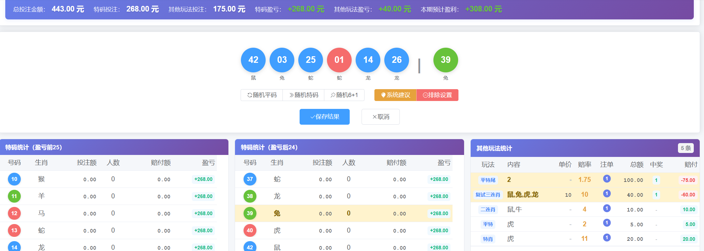
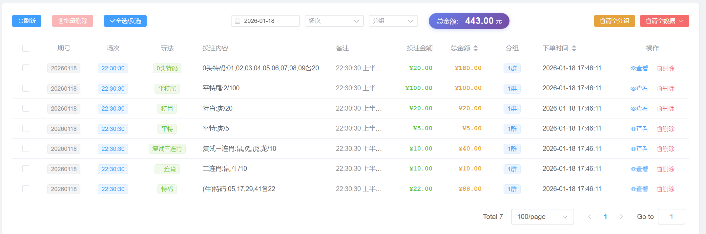

技术支持或定制开发，请联系：
**Telegram**: [@Getshell_Webshell](https://t.me/Getshell_Webshell)

> 基于 Vue 3 + ThinkPHP 8 的现代化彩票投注管理系统

## 📸 系统截图

*特码统计 - 实时显示每个号码的投注情况和盈亏*

*订单管理 - 查看和管理所有投注订单*

## ✨ 核心功能

**投注管理**
- 智能识别多种投注格式，自动解析投注内容
- 支持特码、平特、连肖、中二中三等多种玩法
- 可视化选号界面，支持生肖、号码、波色快速选择
- 批量操作：删除、清空分组、清空历史数据

**实时统计**
- 特码统计：自动统计每个号码的投注金额、人数、赔付额和盈亏
- 智能排序：按盈亏自动排序，盈利最高的号码排在前面
- 双表展示：左右两个表格分别显示盈亏前 25 和后 24 的号码
- 场次筛选：支持按上半场/下半场筛选统计数据
- 自动刷新：进入页面自动根据时间选择场次并加载数据

**智能开奖**
- 模拟开奖：选择 7 个号码（6 个平码 + 1 个特码）模拟开奖结果
- 盈亏预测：实时计算选定号码组合的预计盈利
- 智能建议：系统自动推荐盈利最高的特码号码
- 随机生成：支持随机生成平码、特码或完整开奖号码
- 排除设置：可设置排除特定号码，避免选中高风险号码

**数据管理**
- 订单列表：查看所有投注订单，支持筛选和排序
- 总金额统计：实时显示当前筛选条件下的总投注金额
- 分组管理：支持多个投注分组，独立统计互不影响
- 场次管理：支持多场次配置，自动根据时间切换

## 🛠️ 技术栈

Vue 3 + ThinkPHP 8 + MySQL + Nginx

---

⭐ 如果这个项目对你有帮助，欢迎 Star 支持！
